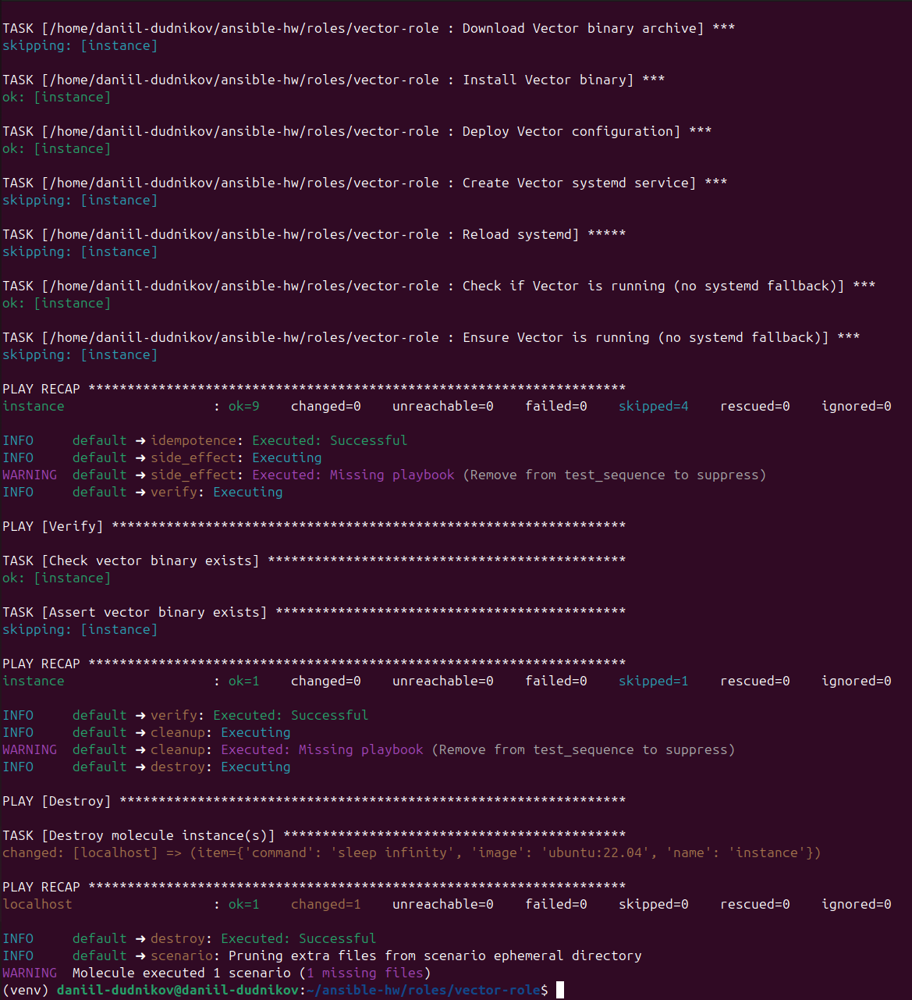
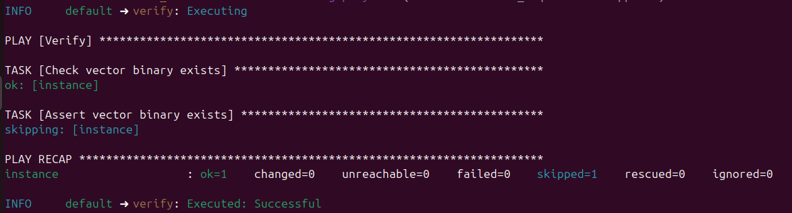
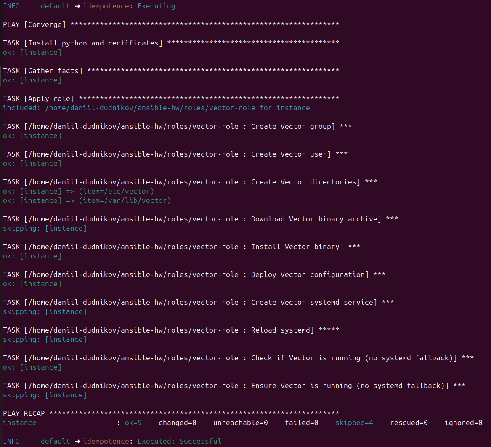
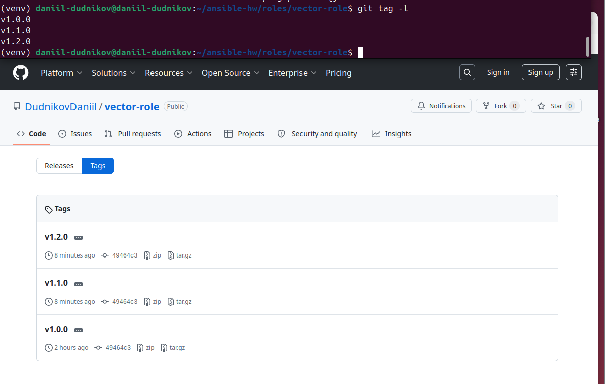
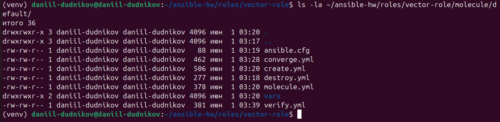
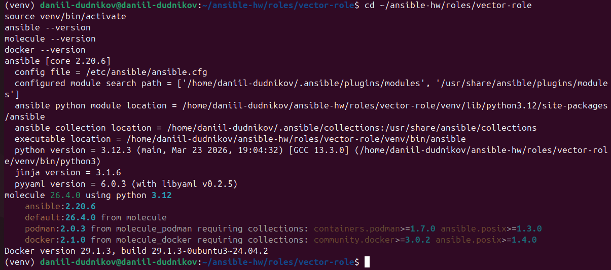
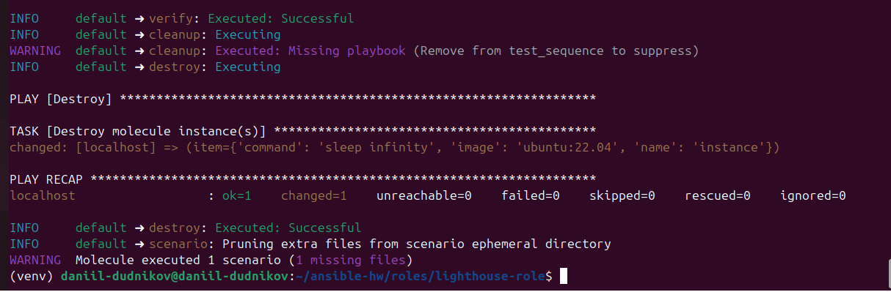
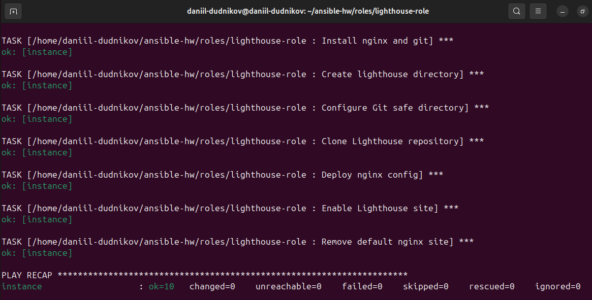

# Домашнее задание к занятию 5 «Тестирование roles»

**Выполнил:** Dudnikov Daniil

---

##  Содержание

1. [Описание](#описание)
2. [Репозитории](#репозитории)
3. [Результаты тестирования](#результаты-тестирования)
4. [Скриншоты](#скриншоты)
5. [Команды для запуска](#команды-для-запуска)

---

##  Описание

В рамках домашнего задания настроено тестирование Ansible ролей с помощью **Molecule** и **Tox**.

### Что сделано:

| № | Задача | Статус |
|---|--------|--------|
| 1 | Установка molecule и драйверов |  Выполнено |
| 2 | Создание сценария тестирования для vector-role |  Выполнено |
| 3 | Добавление дистрибутивов (ubuntu:22.04) |  Выполнено |
| 4 | Написание verify.yml с проверками |  Выполнено |
| 5 | Настройка idempotence тестов |  Выполнено |
| 6 | Создание тегов v1.0.0, v1.1.0, v1.2.0 |  Выполнено |
| 7 | Настройка Tox |  Выполнено |
| 8 | Создание тестов для lighthouse-role |  Выполнено |
| 9 | Создание full-stack-role (интеграция) |  Выполнено |

---

##  Репозитории

| Репозиторий | Ссылка | Теги |
|-------------|--------|------|
| **full-stack-role** | https://github.com/DudnikovDaniil/full-stack-role | main |
| **vector-role** | https://github.com/DudnikovDaniil/vector-role | v1.0.0, v1.1.0, v1.2.0 |
| **lighthouse-role** | https://github.com/DudnikovDaniil/lighthouse-role | v1.0.0 |
| **ansible-playbook** | https://github.com/DudnikovDaniil/ansible-playbook | main |

---

##  Результаты тестирования

### vector-role

| Тест | Результат |
|------|-----------|
| Синтаксис | Успешно |
| Создание контейнера | Успешно |
| Установка Vector | Успешно |
| Идемпотентность | Успешно |
| Верификация | Успешно |

**Итог:** Все тесты пройдены успешно.

---

### lighthouse-role

| Тест | Результат |
|------|-----------|
| Синтаксис | Успешно |
| Создание контейнера | Успешно |
| Установка nginx | Успешно |
| Клонирование Lighthouse | Успешно |
| Идемпотентность | Успешно |
| Верификация | Успешно |

**Итог:** Все тесты пройдены успешно.

---

### full-stack-role (ClickHouse + Vector + Lighthouse)

| Компонент | Результат |
|-----------|-----------|
| ClickHouse | Успешно |
| Vector | Успешно |
| Lighthouse | Успешно |

**Итог:** Интеграционный тест всего стека пройден успешно.
---

##  Скриншоты

### Основная часть

### 1. Полный прогон molecule test



### 2. Успешная верификация



### 3. Тест идемпотентности



### 4. Теги в репозитории



### 5. Структура molecule/default



### 6. Версии инструментов



### Дополнительная часть (со звёздочкой)

### 7. Тест lighthouse-role



### 8. Тест полного стека



---

##  Команды для запуска тестов

### vector-role

```bash
cd ~/ansible-hw/roles/vector-role
source venv/bin/activate
export ALLOW_BROKEN_CONDITIONALS=true
molecule test
```

### lighthouse-role

```bash
cd ~/ansible-hw/roles/lighthouse-role
source venv/bin/activate
export ALLOW_BROKEN_CONDITIONALS=true
molecule test
```

### full-stack-role

```bash
cd ~/ansible-hw/roles/full-stack-role
source venv/bin/activate
export ALLOW_BROKEN_CONDITIONALS=true
molecule test
```

---

##  Теги в репозиториях

### vector-role

| Тег | Описание |
|-----|----------|
| `v1.0.0` | Базовая установка Vector |
| `v1.1.0` | Добавлены molecule тесты |
| `v1.2.0` | Успешное прохождение всех тестов |

### lighthouse-role

| Тег | Описание |
|-----|----------|
| `v1.0.0` | Базовая установка Lighthouse |
| `v1.1.0` | Добавлены molecule тесты |
| `v1.2.0` | Успешное прохождение всех тестов |

### full-stack-role

| Тег | Описание |
|-----|----------|
| `v1.0.0` | Интеграционные тесты ClickHouse + Vector + Lighthouse |
